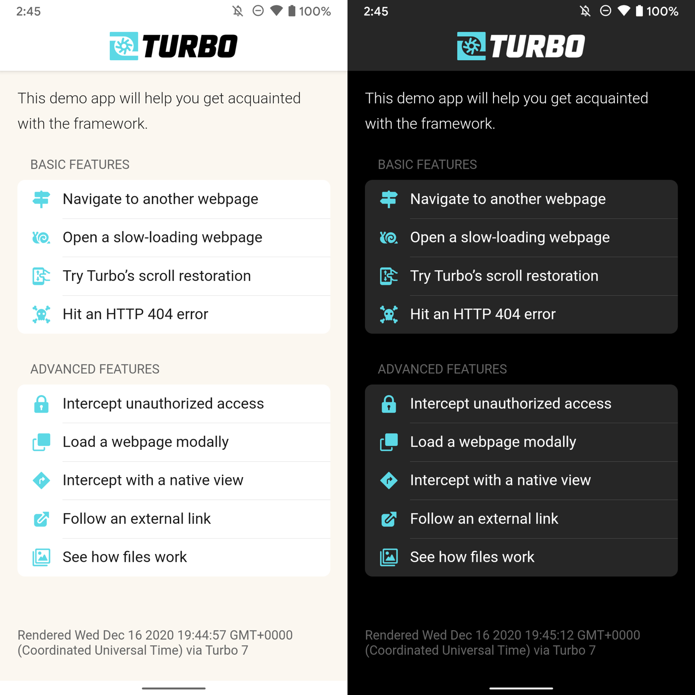

# Running the Demo Android App

To run the demo, clone this repo, open the directory in Android Studio, and build the `demo` module to your Android device.

The demo is a small app to demonstrate how to use Turbo with a native app. The web demo site lives at [https://turbo-native-demo.glitch.me](https://turbo-native-demo.glitch.me) and its source code is available [here](https://github.com/hotwired/turbo-native-demo).

